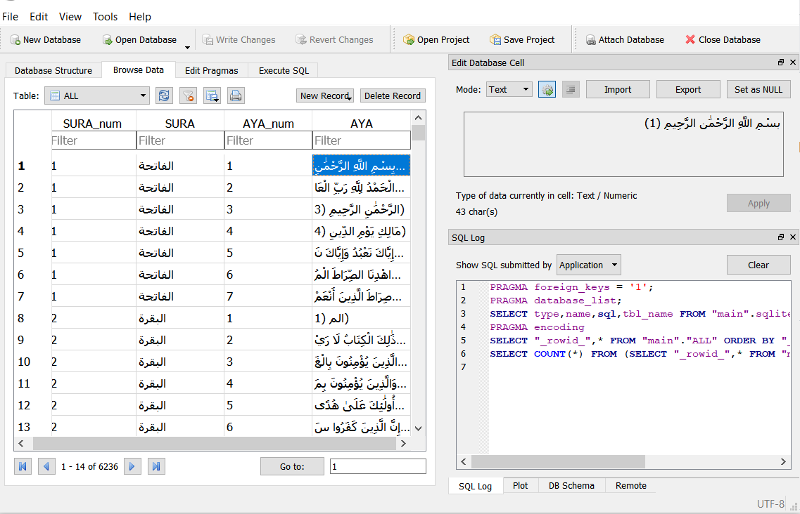
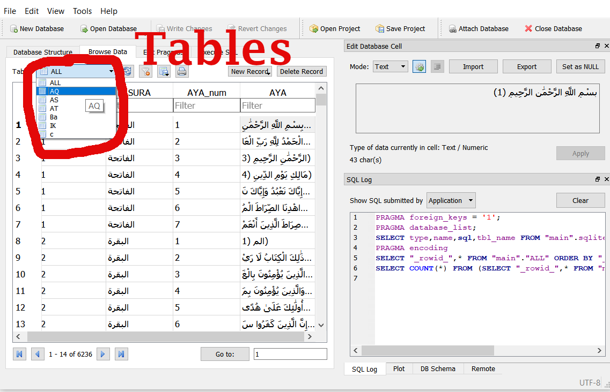
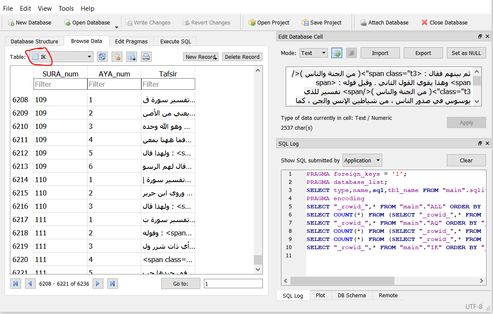
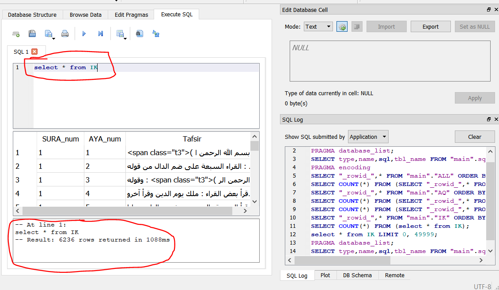

# Quraan_DB - القرآن الكريم في قاعدة بيانات 
The Full Quraan SQLite Database

Database type:SQLite3


انا الحمد لله و بعون الله خلصتها و بقدمها لكوا تكملوا بعدي 
جايز تستفيدوا 
و لو فيه اي تعديل او حاجة ياريت تقولولي و تفيديوني بإذن الله 
قدر الامكان
 انا جبته من Quran.ksu.edu.sa

قبل ما يشيلوه من الموقع 

يا رب اكون عملت حاجة كويسة كده
-- ممكن يكون ناقص اية في التفسير انما في القرآن لا الحمد لله قدرت اراجع في القرآن اما في التفسيرات ما قدرتش اوي --


| Database Mapping | <----> |التفسير|
|:-:|:-:|:-:|
|AQ|al qortobi|القرطبي|
|AS|al saadi|السعدي|
|Ba|al baghawy|البغوي|
|IK|ibn katheer|ابن كثير|
|AT|el tabary|(_غير موجود_)الطبري|

## PHP code to select:

```
//////////////////////////////////////
$tafseers=["AQ","AS","AT","Ba","IK"];
$taf=$tafseers[0];//="AQ";
/////////////////////////////////////

//CONNECTION to DATABASE//
if (file_exists("Quraan.db")){
$con = new SQLite3('Quraan.db');

$s_num=1;//sura number
$a_num=1;//aya number
$res = $con->query("select * from `{$taf}` where `SURA_num`={$s_num} and `AYA_num`={$a_num}");
$result=$res->fetchArray();

echo "SURA_num: {$result[0]} - AYA_num: {$result[1]} - Tafsir:<br/>{$result[2]}"; 

$con->close();
// CONNECTION END //
}

```

## Python code to select:

```
import sqlite3 as sql
tafseers=["AQ","AS","AT","Ba","IK"]
taf=tafseers[0]
s_num=1;//sura number
a_num=1;//aya number
con=sql.connect("Quraan.db")
db=con.cursor()
t_all=db.execute('select * from `'+taf+'` where `SURA_num`='+str(s_num)+' and `AYA_num`='+str(a_num)).fetchall()
print("SURA_num: "+t_all[0]+"AYA_num: "+t_all[1]+"\n"+"Tafseer: "+t_all[2]);
con.close()

#OLDCODE:
#db2.execute('insert into `'+tafs[3]+' VALUES ('+str(s)+','+str(t_all[0][1])+',"'+t_all[0][2]+'");')
#con2.commit()
```


--------

--------

---------



